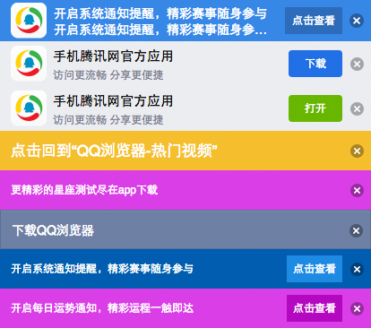

Banner
---

### Install
```sh
aimee i banner --save
```

### Usage
```js
var data = {
    banner: {
        icon: '../images/banner/img/logo.png',
        text: '开启系统通知提醒，精彩赛事随身参与',
        link: {
            val: '点击查看',
            url: 'javascript:;'
        }
    }
}
```
```js
this.exports('banner', app => {
    app.init(data).render()
})
```

### Preview

